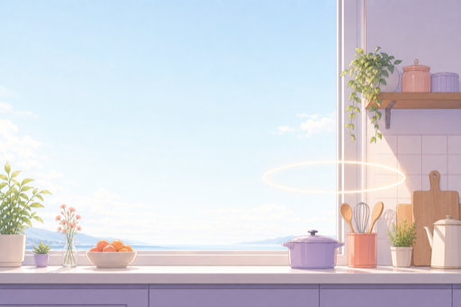
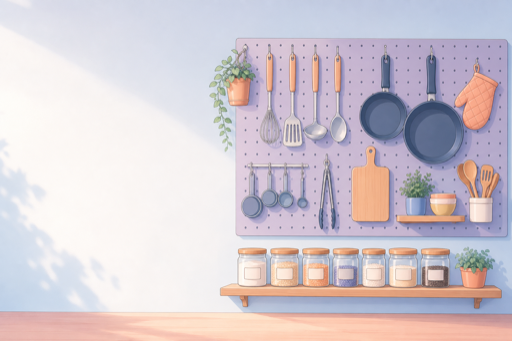
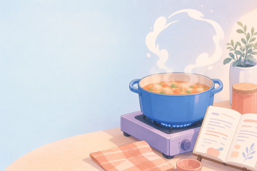
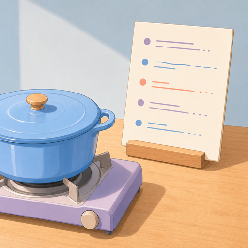
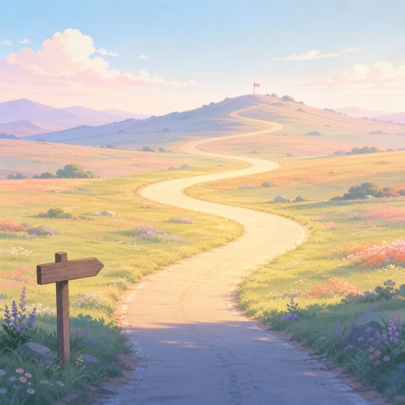

# Style guide: pastel anime slide art

A reusable style recipe for generating a **cohesive set** of presentation-deck illustrations with `codex-imagegen` (gpt-image-2). Clean flat anime background art, soft pastel palette, no characters, no text — designed so slide titles can be overlaid directly on the image.

| | | |
|---|---|---|
|  |  |  |
| title hero (3:2) | section divider (3:2) | section divider (3:2) |
|  |  | |
| side panel (1:1) | side panel (1:1) | |

## The style block

Paste this verbatim as the `Style:` line of every prompt in the set. Repeating the exact same wording is what keeps a multi-image set looking like one artist drew it.

```text
Style: clean flat anime background art with cel shading, soft pastel palette
of pale sky blue, lavender, soft coral and peach, minimal thin linework,
gentle light, subtle soft shadows.
```

And this as the `Constraints:` line:

```text
Constraints: no people, no characters, no readable text, no letters,
no numbers, no logo, no watermark.
```

## Prompt template

Follow the labeled schema from Codex's own imagegen guide (`codex_imagegen.py guide`):

```text
Use case: presentation <title slide background | section divider | slide side artwork>.
Scene: <the concrete setting, one or two sentences>.
Subject: <the single metaphor this image must carry>.
Style: <style block above>.
Composition: <aspect + where the subject sits + WHERE THE EMPTY SPACE IS>.
Lighting: <"gentle morning light" or similar, keep it soft>.
Constraints: <constraints block above>.
```

## Rules that make it work

1. **One metaphor per image.** Decide what the slide's message is, then give the image exactly one subject that carries it (a glowing ring = a loop about to run; a pegboard of tools = the stable equipment layer; steam curling into a circle = a cycle in progress; a sunlit stretch of road = the autonomous segment).
2. **Reserve negative space for text, in the prompt.** Say explicitly which region must stay pale and empty, e.g. `the upper-left sky kept very pale and empty so dark title text can be overlaid later` or `left half a calm pale wall with empty space for large dark text`. This is what makes the images usable as full-bleed slide backgrounds.
3. **Same palette words, every prompt.** Pale sky blue / lavender / soft coral / peach. Repeating the color names verbatim is more reliable than hoping the model stays consistent.
4. **No text in the art, ever.** Anything with writing (recipe cards, jar labels) becomes "abstract stroke lines" or "blank labels". Titles belong to the slide layer, not the bitmap.
5. **`--quality medium` is enough.** Cel-shaded flat art has no gradients fine enough to need `high`; medium is faster and cheaper.

## Worked examples

The five prompts that produced the previews above (paths shortened):

```bash
# title hero, 3:2 — empty sky upper-left for the title
python3 scripts/codex_imagegen.py generate "Use case: presentation title slide full-bleed background. Scene: a bright, tidy kitchen counter seen from the front, a few small pots and utensils neatly arranged, and a wide pale sky visible through a large window filling the upper-left two thirds of the frame. Subject: one thin glowing ring of light floating above the counter like a halo, hinting at a cycle about to run. Style: clean flat anime background art with cel shading, soft pastel palette of pale sky blue, lavender, soft coral and peach, minimal thin linework, gentle morning light, subtle soft shadows, generous negative space. Composition: wide 3:2, counter along the bottom edge, ring right-of-center, the upper-left sky kept very pale and empty so dark title text can be overlaid later. Constraints: no people, no characters, no text, no letters, no numbers, no logo, no watermark." -o hero.png --size 1536x1024 --quality medium

# section divider, 3:2 — subject right, text space left
python3 scripts/codex_imagegen.py generate "Use case: presentation section divider artwork for a chapter about the harness (the stable equipment layer). Scene: a calm kitchen wall with utensils, pans and tools hanging neatly on a pegboard rack, everything in its place, a small shelf with blank jars. Subject: well-organized equipment at rest, ready to be used. Style: clean flat anime background art with cel shading, soft pastel palette of pale sky blue, lavender, soft coral and peach, minimal thin linework, gentle light, subtle soft shadows. Composition: wide 3:2, tools concentrated on the right half, left half a calm pale wall with empty space for large dark text. Constraints: no people, no characters, no readable text, no letters, no numbers, no logo, no watermark." -o part1-harness.png --size 1536x1024 --quality medium

# section divider, 3:2 — a cycle in progress
python3 scripts/codex_imagegen.py generate "Use case: presentation section divider artwork for a chapter about the loop (a cycle running on top of the equipment). Scene: a close view of a blue pot simmering on a small stove, soft steam rising and curling into one loose circular swirl above the pot, an open recipe card with abstract stroke lines propped nearby. Subject: cooking in progress, the steam loop suggesting a repeating cycle. Style: clean flat anime background art with cel shading, soft pastel palette of pale sky blue, lavender, soft coral and peach, minimal thin linework, warm gentle light, subtle soft shadows. Composition: wide 3:2, pot and steam on the right half, left half a calm pale background with empty space for large dark text. Constraints: no people, no characters, no readable text, no letters, no numbers, no logo, no watermark." -o part2-loop.png --size 1536x1024 --quality medium

# side panel, 1:1 — sits beside text content
python3 scripts/codex_imagegen.py generate "Use case: presentation slide side artwork for a kitchen-and-recipe metaphor. Scene: a cozy kitchen counter close-up with a blue pot on a small stove and a recipe card standing on a wooden holder beside it, the card showing only abstract line strokes as steps. Subject: the pair of kitchen (equipment) and recipe (procedure) sharing one counter. Style: clean flat anime background art with cel shading, soft pastel palette of pale sky blue, lavender, soft coral and peach, minimal thin linework, gentle morning light, subtle soft shadows. Composition: square, vertical arrangement with the pot lower-left and the recipe card upper-right, calm pale wall behind. Constraints: no people, no characters, no readable text, no letters, no numbers, no logo, no watermark." -o kitchen-recipe.png --size 1024x1024 --quality medium

# side panel, 1:1 — journey with a brighter middle stretch
python3 scripts/codex_imagegen.py generate "Use case: presentation slide side artwork about an autonomous stretch of a journey. Scene: a gently winding empty road crossing soft pastel meadows toward the horizon under a pale morning sky; a small starting signpost at the bottom and a tiny flag on a distant hill at the top. Subject: the long middle stretch of the road washed in warm morning sunlight, noticeably brighter than both ends. Style: clean flat anime background art with cel shading, soft pastel palette of pale sky blue, lavender, soft coral and peach, minimal thin linework, gentle light, subtle soft shadows. Composition: square, road S-curving from bottom center to upper center, wide calm space on both sides. Constraints: no people, no characters, no cars, no text, no letters, no numbers, no logo, no watermark." -o autopilot.png --size 1024x1024 --quality medium
```

## Practical notes

- **Size adherence is loose.** gpt-image-2 sometimes returns 1254x1254 for a 1024x1024 request. Don't regenerate — downscale locally: `sips -z 1024 1024 <file>` (macOS) or `magick <file> -resize 1024x1024! <file>`.
- **Iterate one condition at a time.** If a result drifts, change exactly one thing (subject, composition, or lighting) and keep the rest of the prompt — especially the style and constraints blocks — identical. Changing several lines at once loses set cohesion.
